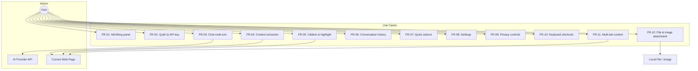
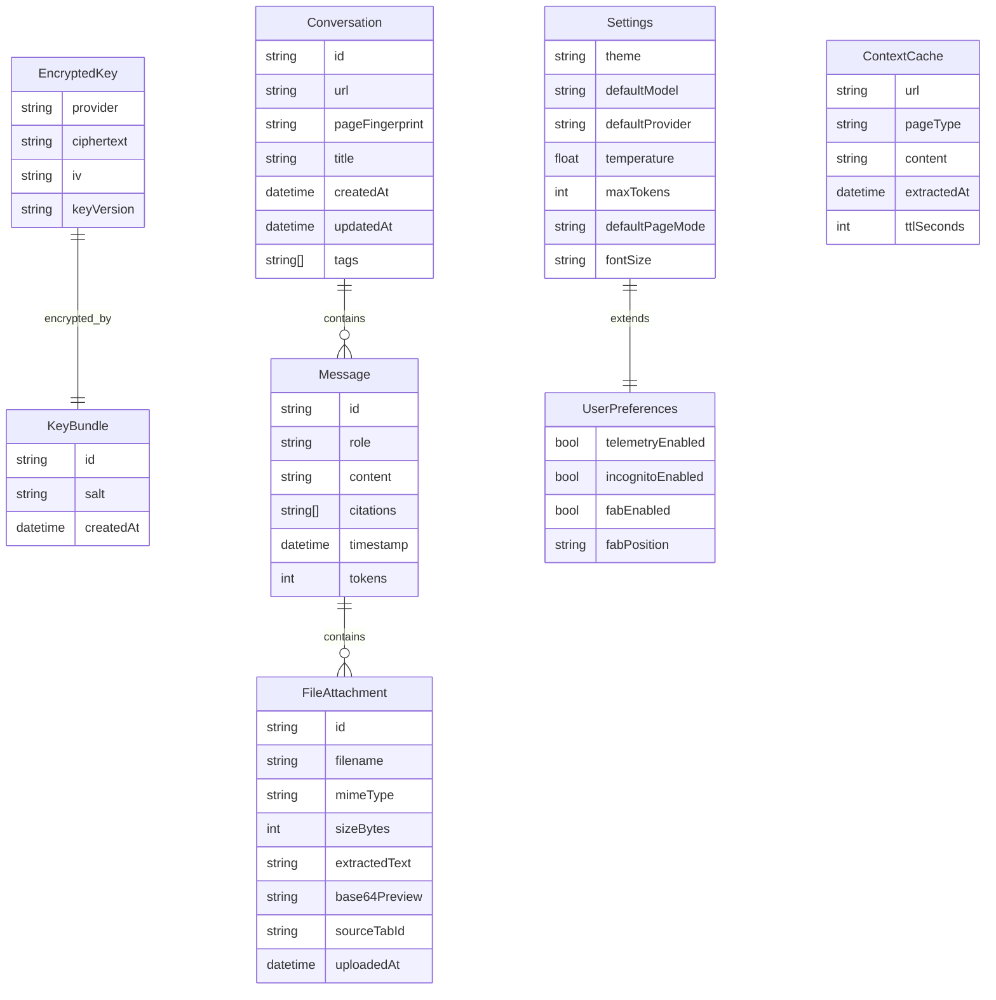
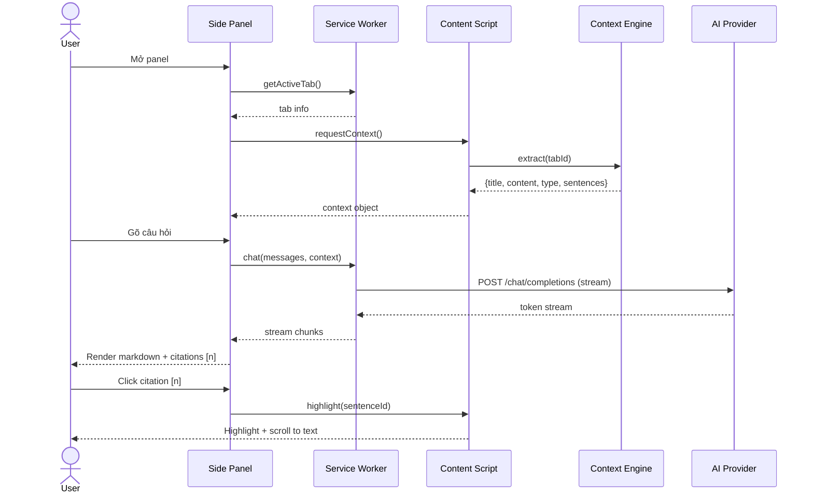
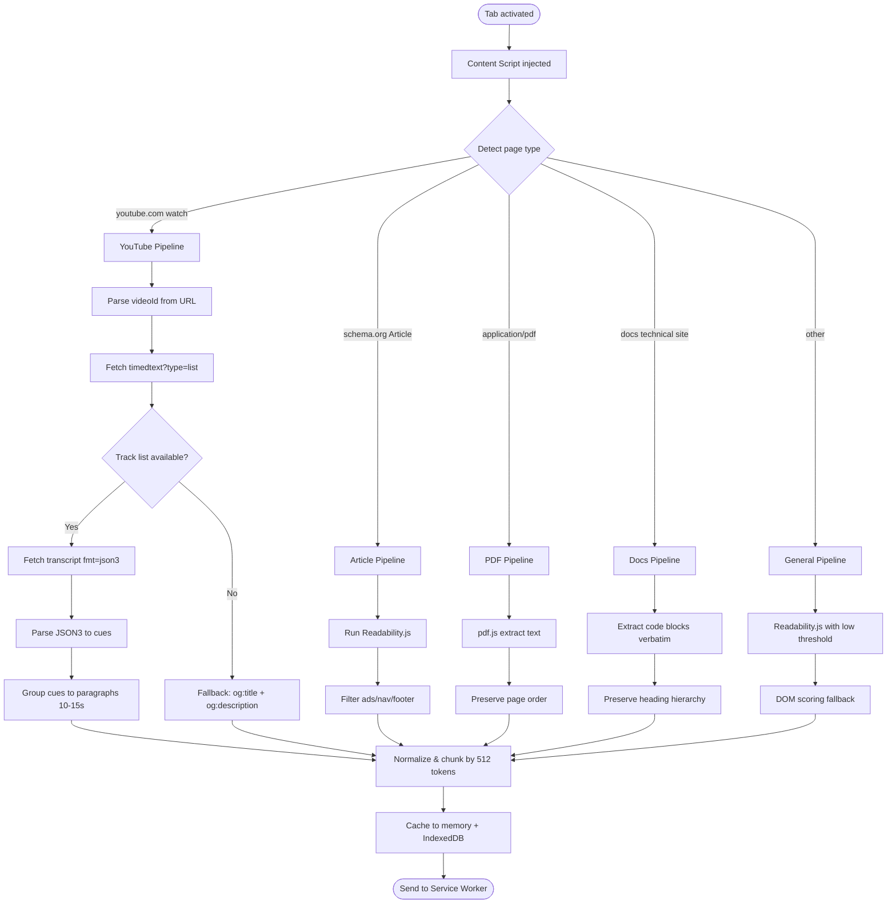
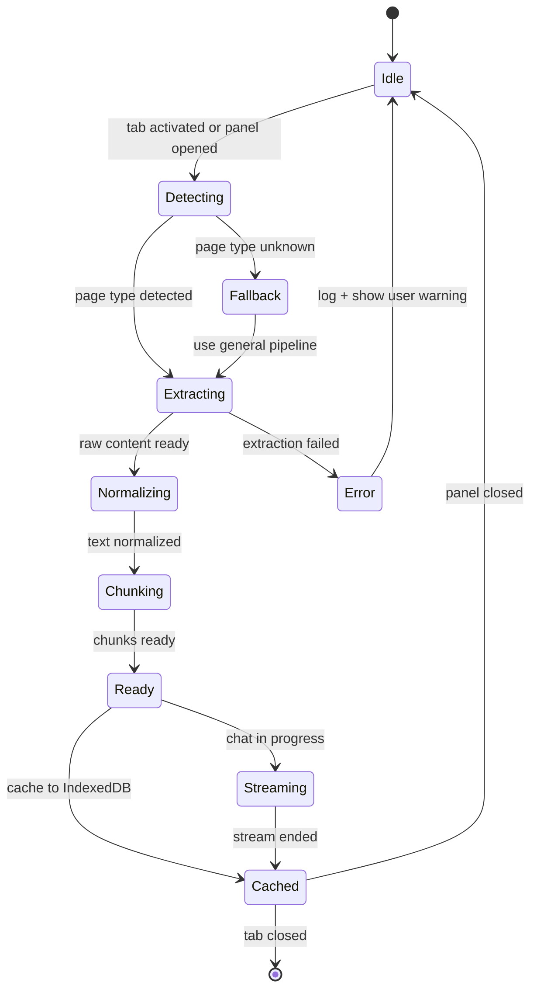
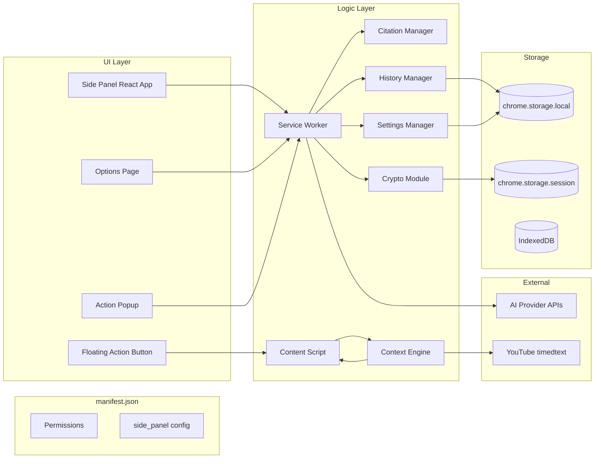
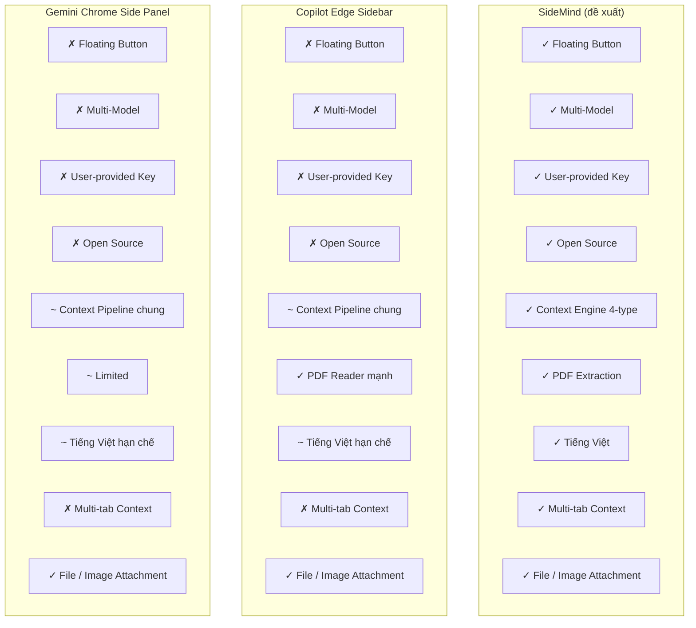

# Software Requirements Specification (SRS)
## SideMind — Chrome Extension Chat Sidebar

| | |
|---|---|
| **Phiên bản** | 0.3.0 (Draft) |
| **Ngày** | 2026-09-16 |
| **Tác giả** | Nhóm đồ án cuối kỳ — môn học UDDN |
| **Chuẩn** | IEEE Std 830-1998 |
| **Trạng thái** | Draft — bổ sung FR-11 (multi-tab), FR-12 (file/image), FR-13 (slash command mở rộng); NFR-08 + NFR-09 mới |

---

## Mục lục

1. [Giới thiệu](#1-giới-thiệu)
   - 1.1 [Mục đích](#11-mục-đích)
   - 1.2 [Phạm vi](#12-phạm-vi)
   - 1.3 [Định nghĩa, từ viết tắt](#13-định-nghĩa-từ-viết-tắt)
   - 1.4 [Tài liệu tham khảo](#14-tài-liệu-tham-khảo)
   - 1.5 [Tổng quan tài liệu](#15-tổng-quan-tài-liệu)
2. [Mô tả tổng quát](#2-mô-tả-tổng-quát)
   - 2.1 [Bối cảnh sản phẩm](#21-bối-cảnh-sản-phẩm)
   - 2.2 [Chức năng sản phẩm](#22-chức-năng-sản-phẩm)
   - 2.3 [Đối tượng người dùng](#23-đối-tượng-người-dùng)
   - 2.4 [Môi trường vận hành](#24-môi-trường-vận-hành)
   - 2.5 [Ràng buộc thiết kế và triển khai](#25-ràng-buộc-thiết-kế-và-triển-khai)
   - 2.6 [Giả định và phụ thuộc](#26-giả-định-và-phụ-thuộc)
3. [Yêu cầu cụ thể](#3-yêu-cầu-cụ-thể)
   - 3.1 [Yêu cầu giao diện bên ngoài](#31-yêu-cầu-giao-diện-bên-ngoài)
   - 3.2 [Yêu cầu chức năng](#32-yêu-cầu-chức-năng)
   - 3.3 [Yêu cầu phi chức năng](#33-yêu-cầu-phi-chức-năng)
   - 3.4 [Ràng buộc thiết kế](#34-ràng-buộc-thiết-kế)
   - 3.5 [Thuộc tính hệ thống](#35-thuộc-tính-hệ-thống)
   - 3.6 [Yêu cầu khác](#36-yêu-cầu-khác)
4. [Phụ lục](#4-phụ-lục)
   - [Phụ lục A: Bảng so sánh](#phụ-lục-a-bảng-so-sánh--sidemind-vs-copilot-edge-vs-gemini-chrome-sidebar)
   - [Phụ lục B: Permission Justification](#phụ-lục-b-permission-justification)
   - [Phụ lục C: Open Issues & Risks](#phụ-lục-c-open-issues--risks)

---

## 1. Giới thiệu

### 1.1 Mục đích

Tài liệu này là **Software Requirements Specification (SRS)** cho sản phẩm **SideMind** — một Chrome Extension hoạt động như chat sidebar tích hợp AI trên trình duyệt. SRS được viết theo chuẩn IEEE Std 830-1998.

Mục đích của tài liệu:

- Làm **đầu vào** cho **Software Design Specification (SDS)** ở phase tiếp theo. Tất cả requirement ở đây được đánh ID ổn định (FR-xx, NFR-xx) để SDS có thể tham chiếu chéo.
- Phục vụ **chương so sánh** trong báo cáo cuối kỳ — đối tượng so sánh là **Microsoft Copilot (Edge sidebar)** và **Gemini in Chrome (side panel)**. Phiên bản Gemini được so sánh là **side panel trong Chrome**, không phải gemini.google.com.
- Là tài liệu tham chiếu cho dev team trong quá trình implement và testing.

**Đối tượng đọc**: giảng viên hướng dẫn, thành viên nhóm, người review báo cáo cuối kỳ.

### 1.2 Phạm vi

**SideMind** là một Chrome Extension (Manifest V3) cung cấp:

- **Chat sidebar** (sử dụng `chrome.sidePanel` API) xuất hiện bên phải trình duyệt.
- **Floating Action Button (FAB)** trên mọi trang web để mở panel nhanh — đây là điểm UX khác biệt so với Copilot Edge sidebar và Gemini Chrome side panel (cả hai đều không có FAB).
- **Context-awareness vượt trội**: tự động trích xuất nội dung chính của trang web hiện tại (bài báo, YouTube, PDF, technical docs, web tổng quát) và dùng làm context cho AI.
- **Multi-tab context** (FR-11): user chọn nhiều tab cùng lúc, mỗi tab đóng góp context riêng cho AI.
- **File / image attachment** (FR-12): upload ảnh hoặc file local (ảnh, PDF, text, docx, xlsx, code). Nội dung được trích ở client (FileReader API, pdf.js, mammoth.js, xlsx), gửi thẳng tới AI Provider qua HTTPS — không qua proxy server nào của nhóm phát triển.
- **Citation & highlight**: mỗi câu trả lời AI có anchor `[n]` trỏ về đoạn text gốc trên trang; nhấn anchor sẽ highlight đoạn đó trên tab nền.
- Hỗ trợ **đa mô hình AI**: OpenAI, Anthropic, Gemini (user tự cung cấp API key).

**Quyết định kiến trúc cốt lõi**: SideMind hoạt động **hoàn toàn client-side, không có backend do nhóm phát triển**. Mọi xử lý — context extraction (single & multi-tab), file/image parsing, conversation history, settings, AI request routing — đều chạy trong browser process (Service Worker + Content Script + Side Panel). Extension gọi trực tiếp AI Provider API (OpenAI / Anthropic / Gemini) qua HTTPS từ trình duyệt của user, không qua proxy server. Lý do: (1) privacy — user dữ liệu không qua server bên thứ ba ngoài AI provider; (2) cost transparency — user trả trực tiếp qua API key của mình; (3) zero-ops — extension là tập file tĩnh, không cần hosting, database, hay auth system; (4) vendor neutrality — swap AI provider bằng 1 click, không lock-in; (5) open-source friendly — public MIT mà không ảnh hưởng kinh doanh.

**Lý do no-backend vẫn giữ được khi bổ sung file/image** (FR-12): cả 3 provider hiện tại đều hỗ trợ multimodal (GPT-4o, Claude, Gemini Vision) nhận ảnh base64 qua HTTPS trực tiếp; file text/PDF/docx được trích nội dung ở client trước khi gửi. File không bao giờ rời khỏi máy user ngoài provider API.

**Không trong scope** của phiên bản này: server backend do nhóm phát triển, multi-user / cloud sync, mobile app, training / fine-tuning model riêng, local LLM (WebLLM — cân nhắc cho v2.0), cloud sync cho file upload (mỗi máy lưu local), OCR native cho ảnh scan nhiều trang (phụ thuộc provider Vision), file binary > 20 MB (video, archive lớn).

### 1.3 Định nghĩa, từ viết tắt

| Thuật ngữ | Định nghĩa |
|---|---|
| MV3 | Manifest V3 — phiên bản mới nhất của Chrome Extension manifest |
| FAB | Floating Action Button — nút nổi trên trang web |
| SRS | Software Requirements Specification |
| SDS | Software Design Specification |
| FR | Functional Requirement |
| NFR | Non-Functional Requirement |
| CSP | Content Security Policy |
| Side Panel | Chrome Side Panel API (`chrome.sidePanel`) |
| Readability.js | Thư viện Mozilla trích xuất main content từ trang web |
| WebLLM | Thư viện chạy LLM trực tiếp trong trình duyệt qua WebGPU |
| AES-GCM | Advanced Encryption Standard — Galois/Counter Mode |
| WebVTT | Web Video Text Tracks — định dạng caption cho video web |
| JSON3 | Định dạng transcript của YouTube (events chứa tStartMs, dDurationMs, segs) |
| p95 | Percentile 95 — chỉ số hiệu năng dùng trong NFR |
| LRU | Least Recently Used — thuật toán cache eviction |

### 1.4 Tài liệu tham khảo

1. Chrome Extensions — Manifest V3. https://developer.chrome.com/docs/extensions/develop/concepts/manifestv3
2. Chrome `chrome.sidePanel` API. https://developer.chrome.com/docs/extensions/reference/api/sidePanel
3. Chrome `chrome.storage` API. https://developer.chrome.com/docs/extensions/reference/api/storage
4. Chrome Web Store — Permission Justification Guidelines. https://developer.chrome.com/docs/webstore/program-policies/permissions
5. OpenAI Chat Completions API. https://platform.openai.com/docs/api-reference/chat
6. Anthropic Messages API. https://docs.anthropic.com/claude/reference/messages
7. Google Gemini API. https://ai.google.dev/api
8. Mozilla Readability.js. https://github.com/mozilla/readability
9. Mozilla pdf.js. https://mozilla.github.io/pdf.js/
10. Web Crypto API — `crypto.subtle`. https://developer.mozilla.org/en-US/docs/Web/API/Web_Crypto_API
11. WCAG 2.1 AA Quick Reference. https://www.w3.org/WAI/WCAG21/quickref/
12. IEEE Std 830-1998 — Recommended Practice for Software Requirements Specifications.

### 1.5 Tổng quan tài liệu

SRS gồm 3 phần chính:

- **Section 2 — Mô tả tổng quát**: bối cảnh sản phẩm, use-case tổng quát (Hình 1), đối tượng người dùng, môi trường vận hành, ràng buộc thiết kế, giả định và phụ thuộc.
- **Section 3 — Yêu cầu cụ thể**: yêu cầu giao diện, yêu cầu chức năng (13 FR: FR-01 → FR-13), yêu cầu phi chức năng (9 NFR: NFR-01 → NFR-09), ràng buộc thiết kế, thuộc tính hệ thống (Hình 2). Context engine ở §3.2 có flowchart (Hình 4) và state machine (Hình 5). Multi-tab context (FR-11) và file/image attachment (FR-12) mở rộng scope v0.2.0 so với bản gốc 0.1.0.
- **Section 4 — Phụ lục**: bảng so sánh SideMind vs Copilot Edge vs Gemini Chrome sidebar; bảng permission justification; open issues & risks.

Tài liệu chứa **8 Mermaid diagrams** đánh số Hình 1–Hình 8, có thể trích nguyên sang SDS và báo cáo cuối kỳ.

---

## 2. Mô tả tổng quát

### 2.1 Bối cảnh sản phẩm

SideMind là một Chrome Extension độc lập, hoạt động hoàn toàn ở client-side. Sản phẩm nằm trong hệ sinh thái Chrome Extension và tương tác với:

- **Trình duyệt Chrome**: thông qua các Chrome Extension API (`sidePanel`, `storage`, `scripting`, `tabs`, `commands`, `contextMenus`, `action`).
- **AI Provider APIs**: OpenAI, Anthropic, Google Gemini — gọi trực tiếp từ browser của user, không qua proxy server (xem §1.2).
- **Trang web hiện tại**: thông qua content script để trích xuất context và inject FAB.

**Đặc điểm kiến trúc đáng chú ý — Stateless**: SideMind là **stateless từ phía nhóm phát triển** — không có database server, không có session store, không có analytics server. Toàn bộ state (settings, API key mã hóa, conversation history, context cache) nằm trong `chrome.storage.local` / `chrome.storage.session` / IndexedDB của trình duyệt user. Khi user gỡ extension, toàn bộ data bị xóa cùng extension. Đây là điểm khác biệt triết lý so với Copilot Edge (Microsoft lưu log ở Azure) và Gemini Chrome (Google lưu log ở Cloud).

**Bối cảnh so sánh** (chi tiết ở Phụ lục A):

| Tiêu chí | SideMind (đề xuất) | Microsoft Copilot (Edge sidebar) | Gemini in Chrome (side panel) |
|---|---|---|---|
| Loại sản phẩm | Chrome Extension, open-source, user tự host | Tích hợp sẵn trong Edge | Tích hợp sẵn trong Chrome |
| AI model | Đa model (OpenAI / Anthropic / Gemini) | OpenAI GPT only | Google Gemini only |
| Floating button | Có | Không | Không |
| Citation + highlight | Có (chính xác tới đoạn văn) | Có (hạn chế) | Có (citation chip) |
| API key | User tự cung cấp | Do Microsoft quản lý | Do Google quản lý |
| Open source | Có (MIT) | Không | Không |

### 2.2 Chức năng sản phẩm



**Hình 1**: Use-case diagram tổng quát của SideMind (Actors + 12 use cases + external dependencies).

### 2.3 Đối tượng người dùng

| User class | Mô tả | Tần suất sử dụng | Nhu cầu chính |
|---|---|---|---|
| **Sinh viên** | Đọc tài liệu học thuật, research, cần tóm tắt nhanh | Hàng ngày | Tóm tắt nhanh, giải thích khái niệm |
| **Researcher** | Đọc nhiều bài báo, cần trích dẫn chính xác | Hàng ngày | Citation chính xác, multi-paper comparison |
| **Developer** | Đọc docs kỹ thuật, hỏi đáp API/framework | Hàng ngày | Code explanation, API reference, debugging |
| **Content creator** | Đọc tin tức, blog, cần rewrite hoặc tóm tắt | Hàng tuần | Tóm tắt, rewrite, translate |
| **Người dùng phổ thông** | Dùng trình duyệt hàng ngày | Thỉnh thoảng | Trợ giúp chung, giải thích trang web |

### 2.4 Môi trường vận hành

- **Trình duyệt**: Google Chrome phiên bản ≥ 120 (hỗ trợ `chrome.sidePanel` API ổn định).
- **Trình duyệt phụ**: Microsoft Edge, Brave, Opera, Arc — tương thích cơ bản (Chromium-based) nhưng không cam kết đầy đủ.
- **Hệ điều hành**: Windows 10/11, macOS 12+, Linux (Ubuntu 22.04+).
- **Kết nối mạng**: Bắt buộc có HTTPS để gọi AI Provider APIs. Không hoạt động offline ở v1.
- **Phần cứng tối thiểu**: 4GB RAM, 200MB disk cho extension + cache.

### 2.5 Ràng buộc thiết kế và triển khai

- **MV3 only**: Không dùng MV2 (Chrome đã ngừng hỗ trợ). Service worker thay cho background page.
- **No remote code**: Tất cả JavaScript phải đóng gói trong extension; không fetch code runtime từ server.
- **CSP nghiêm ngặt**: Chỉ `'self'` cho `script-src`, không inline script, không `eval`.
- **Permission tối thiểu**: Chỉ xin permission thực sự cần dùng (giải thích ở Phụ lục B).
- **No XHR tới domain không khai báo**: Mọi external request phải khai báo trong `host_permissions`.
- **Bundle size**: Toàn bộ extension unpacked ≤ 5MB.
- **i18n-ready**: Tất cả string người dùng thấy phải qua i18n key, không hardcode.
- **File System Access API**: chỉ dùng trên Chrome ≥ 120 với permission tương ứng (FR-12); fallback dùng `<input type="file">` cổ điển nếu không khả dụng hoặc user chưa cấp quyền.

### 2.6 Giả định và phụ thuộc

- **Giả định**: User có API key hợp lệ của ít nhất 1 trong 3 provider (OpenAI, Anthropic, Gemini).
- **Phụ thuộc**: AI Provider APIs không thay đổi breaking change trong thời gian phát triển. Nếu có, team sẽ cập nhật adapter layer.
- **Giả định**: User sử dụng Chrome bản mới nhất hoặc có cập nhật tự động.
- **Phụ thuộc bên thứ ba**: Readability.js (Mozilla, MPL 2.0), pdf.js (Mozilla, Apache 2.0), React (MIT) — đều là thư viện open-source có license thương mại-friendly.

---

## 3. Yêu cầu cụ thể

### 3.1 Yêu cầu giao diện bên ngoài

#### 3.1.1 Side Panel (ASCII wireframe)

```
+--------------------------------------------------+
|  SideMind                              [≡]  [×]  |
+--------------------------------------------------+
|  Page context: "Article title..."          [↻]   |
|  Type: Article | 2,341 words | Updated 2m ago    |
+--------------------------------------------------+
|                                                  |
|  You: Tóm tắt bài này                           |
|                                                  |
|  AI: Bài viết phân tích 3 điểm chính:           |
|      - Hiệu suất tăng 40% [1]                   |
|      - Chi phí giảm 25% [2]                     |
|      - Trải nghiệm người dùng cải thiện [3]     |
|                                                  |
+--------------------------------------------------+
|  [📎 Context] [⚙] | Nhập câu hỏi...  |  [Gửi]    |
+--------------------------------------------------+
```

#### 3.1.2 Floating Action Button (FAB)

- Vị trí: góc dưới-phải trang web (`position: fixed; bottom: 16px; right: 16px`).
- Mặc định ẩn khi side panel đang mở.
- Click → mở side panel.
- Drag để sắp xếp lại vị trí (lưu vào storage).

#### 3.1.3 Options Page

- **Tab 1: API Keys** — form nhập key, validate, xóa cho từng provider.
- **Tab 2: General** — theme, model mặc định, temperature, max tokens, font size.
- **Tab 3: Privacy** — telemetry toggle, incognito toggle, nút "Clear all data".
- **Tab 4: Shortcuts** — danh sách keyboard shortcuts và hướng dẫn customize.

#### 3.1.4 Software Interfaces

| Component | API / Interface | Mục đích |
|---|---|---|
| Side Panel UI | `chrome.sidePanel` | Mở/đóng panel, cấu hình behavior |
| Action button | `chrome.action` | Icon trên toolbar, click mở panel |
| FAB injection | `chrome.scripting` + Content Script | Inject FAB vào trang |
| Context extract | DOM API + Readability.js + pdf.js | Trích xuất nội dung trang |
| Multi-tab source | `chrome.tabs.query` + `chrome.tabs.onRemoved` | Lấy tab active + danh sách tab, lắng nghe tab đóng (FR-11) |
| File attachment UI | `<input type="file" multiple>` + File System Access API | Upload local file/ảnh (FR-12) |
| File parser | mammoth.js (docx) + SheetJS / xlsx (xlsx) + pdf.js (pdf, đã có) + FileReader (text/image) | Trích nội dung file ở client-side (FR-12) |
| Storage | `chrome.storage.local`, `chrome.storage.session` | Lưu settings, API key (encrypted), history |
| Crypto | `crypto.subtle` (Web Crypto API) | Mã hóa AES-GCM cho API key |
| AI provider | HTTPS REST (OpenAI / Anthropic / Gemini) | Gọi model AI, streaming response |
| YouTube transcript | `https://www.youtube.com/api/timedtext` (public) | Fetch caption track |
| Vimeo / HTML5 track | `player.vimeo.com/captions.vtt`, `video.textTracks` | Caption cho web khác (v2) |
| Context menu | `chrome.contextMenus` | Right-click → quick action |
| Tabs | `chrome.tabs`, `chrome.tabGroups` | Lấy tab active, switch tab khi highlight |
| Keyboard shortcuts | `chrome.commands` | Đăng ký global shortcuts |

#### 3.1.5 Storage Schema



**Hình 6**: ER diagram của storage schema trong `chrome.storage.local` và `chrome.storage.session`.

#### 3.1.6 Communication Interfaces

- **AI Provider APIs**: HTTPS, REST, streaming response (Server-Sent Events hoặc chunked transfer-encoding).
- **YouTube Timedtext**: HTTPS GET, response là XML (legacy) hoặc JSON3.
- **Internal communication**: Content Script ↔ Service Worker ↔ Side Panel qua `chrome.runtime.sendMessage` và `chrome.runtime.connect` (port-based cho streaming).

### 3.2 Yêu cầu chức năng

Mỗi FR có: ID, mô tả, priority (MUST / SHOULD / MAY), acceptance criteria.

---

#### FR-01: Mở / đóng side panel

| | |
|---|---|
| **Mô tả** | User mở/đóng side panel qua action icon trên toolbar hoặc FAB trên trang web. |
| **Priority** | MUST |
| **Acceptance criteria** | (1) Click action icon trên toolbar → side panel mở. (2) Click FAB trên trang web → side panel mở, FAB ẩn. (3) Click nút `[×]` trong panel → panel đóng, FAB hiện lại. (4) Thời gian mở/đóng ≤ 200ms (theo NFR-01). (5) Trạng thái mở/đóng được lưu per-tab. |

#### FR-02: Quản lý API key

| | |
|---|---|
| **Mô tả** | User nhập, validate, mã hóa và xóa API key cho OpenAI / Anthropic / Gemini trong Options page. |
| **Priority** | MUST |
| **Acceptance criteria** | (1) Form nhập key với provider selector. (2) Validate bằng test API call nhỏ (1 token, prompt "OK"). (3) Key mã hóa AES-GCM-256 trước khi lưu `chrome.storage.local`. (4) Có nút "Xóa key" → confirm dialog → xóa khỏi storage. (5) Hiển thị trạng thái: chưa cấu hình / hợp lệ / không hợp lệ. (6) Hỗ trợ lưu nhiều provider cùng lúc. |

```mermaid
sequenceDiagram
    actor User
    participant Opt as Options Page
    participant SW as Service Worker
    participant Crypto as crypto.subtle
    participant Store as chrome.storage

    User->>Opt: Nhập API key
    Opt->>SW: validateKey(provider, key)
    SW->>AI: Test API call (1 token)
    AI-->>SW: OK / Error
    SW-->>Opt: Valid?

    alt Valid
        Opt->>SW: encryptAndSave(key)
        SW->>Crypto: deriveKey(SHA-256, extensionID + salt)
        Crypto-->>SW: derivedKey
        SW->>Crypto: encrypt(AES-GCM, plaintext, derivedKey, IV)
        Crypto-->>SW: ciphertext
        SW->>Store: set({ciphertext, iv, keyVersion})
        Store-->>SW: OK
        SW-->>Opt: Saved
    else Invalid
        SW-->>Opt: Error message
    end
```

**Hình 7**: Sequence diagram mô tả luồng mã hóa và lưu trữ API key.

#### FR-03: Chat multi-turn

| | |
|---|---|
| **Mô tả** | User chat với AI trong panel, hỗ trợ multi-turn conversation, streaming response, markdown rendering. |
| **Priority** | MUST |
| **Acceptance criteria** | (1) Input box + send button. (2) User message hiển thị phía phải, AI message phía trái. (3) Response stream từng token, render progressively. (4) Markdown render: headings, lists, code blocks với syntax highlight (Prism/Shiki), tables. (5) Nút copy trên mỗi code block. (6) Multi-turn: context lưu trong conversation, AI nhớ các turn trước (tối đa 20 turn hoặc 8000 tokens, sliding window). (7) Nút "Stop generation" để dừng stream. |



**Hình 3**: Sequence diagram cho luồng chat kèm citation và highlight.

#### FR-04: Context extraction engine

| | |
|---|---|
| **Mô tả** | Hệ thống tự động trích xuất nội dung chính của trang web hiện tại, phân loại page type, và cung cấp cho AI làm context. |
| **Priority** | MUST |
| **Acceptance criteria** | (1) Có 4 pipeline riêng cho 4 page type chính — YouTube, Article, PDF, Technical Docs — cộng thêm General fallback. (2) Mỗi pipeline trả về object chuẩn `{title, author, date, content, sentences[], metadata}`. (3) Mỗi pipeline có cơ chế riêng vì cấu trúc DOM và nguồn nội dung khác nhau — dùng chung 1 pipeline cho mọi trang chỉ cho kết quả trung bình. (4) **Article** dùng Mozilla Readability.js + noise filter (loại cookie banner, related articles, comment section). (5) **YouTube** lấy transcript từ `timedtext` API, parse JSON3, group cue ngắn (2-4s) thành đoạn văn 10-15s; fallback về `og:title + og:description` nếu video không có caption. (6) **PDF** dùng pdf.js parse binary, giữ thứ tự trang (Chrome render `*.pdf` thành canvas, content script không inject được vào `chrome-extension://` PDF viewer — phải dùng cách riêng). (7) **Docs** (technical documentation: docs.python.org, MDN, GitHub README, API reference) dùng custom heuristic giữ `<pre>` và `<code>` nguyên văn, giữ heading hierarchy — Readability.js sẽ strip code blocks vì tính theo readability score của prose. (8) **General** là fallback khi không phân loại được: Readability.js + DOM scoring heuristic. (9) Noise filter chung loại bỏ: ads, navigation, footer, cookie banner, related articles, comment section. (10) Multi-level summarization qua slash command: `/tldr` (1 câu), `/summary` (5 bullet), `/full` (toàn văn nguyên xi). |

**Lưu ý quan trọng về caption**: caption (transcript) của YouTube là dạng **timestamped dialogue** (mỗi cue có `{startTimeMs, durationMs, text}`), không phải paragraph HTML — đây là lý do YouTube phải có pipeline riêng. SideMind v1 chỉ cover YouTube (caption endpoint public); Vimeo và HTML5 `<track kind="captions">` được liệt kê trong Phụ lục C làm open issue cho v2.



**Hình 4**: Flowchart của context extraction engine — phân loại trang, áp pipeline tương ứng, normalize, cache.



**Hình 5**: State machine mô tả vòng đời của context extraction.

#### FR-05: Citation & source linking

| | |
|---|---|
| **Mô tả** | Mỗi câu trong câu trả lời AI có anchor `[n]` trỏ về đoạn text gốc; nhấn anchor sẽ highlight trên tab nền. |
| **Priority** | MUST |
| **Acceptance criteria** | (1) Khi AI reference context, mỗi câu trả lời có anchor `[n]` ở cuối câu hoặc cuối đoạn. (2) Click anchor → highlight text gốc trên tab nền (background highlight màu vàng, giữ 3 giây). (3) Auto-scroll tới vị trí text nếu cần. (4) Anchor mapping lưu trong message metadata (sentence ID → DOM range). (5) Hoạt động cross-frame, cross-origin trong cùng page. (6) Citation được re-render khi content script reload (ví dụ SPA route change). |

#### FR-06: Conversation history

| | |
|---|---|
| **Mô tả** | Lưu trữ và truy xuất lịch sử hội thoại, liên kết với URL / page fingerprint. |
| **Priority** | SHOULD |
| **Acceptance criteria** | (1) Mỗi conversation có: id, URL gốc, page fingerprint (SHA-256 của title + content normalized), title, createdAt, updatedAt, tags. (2) List view: sắp xếp theo updatedAt desc. (3) Search theo title + content (full-text search cơ bản). (4) Tag system: add / remove tags. (5) Export: Markdown, JSON. (6) Delete conversation (có confirm). (7) Lưu trong `chrome.storage.local` với cap 1000 conversations, LRU eviction. |

#### FR-07: Quick actions

| | |
|---|---|
| **Mô tả** | Context menu + slash commands cho các tác vụ nhanh. |
| **Priority** | SHOULD |
| **Acceptance criteria** | (1) Right-click trên trang → context menu item: "Summarize with SideMind", "Explain selection", "Translate to...". (2) Slash commands trong input box: `/summarize`, `/explain`, `/translate`, `/rewrite`, `/code`, `/tldr`, `/summary`, `/full`. (3) Slash command + có selection → AI xử lý selection với mode tương ứng. (4) Slash command + không có selection → AI xử lý cả page context. (5) Autocomplete cho slash commands khi user gõ `/`. |

#### FR-08: Settings

| | |
|---|---|
| **Mô tả** | Cấu hình extension: theme, model mặc định, tham số AI, các tùy chọn cá nhân. |
| **Priority** | SHOULD |
| **Acceptance criteria** | (1) Theme: `light` / `dark` / `auto` (theo OS preference). (2) Default model: chọn 1 trong các model đã cấu hình API key (vd: `gpt-4o`, `claude-sonnet-4`, `gemini-2.5-pro`). (3) Temperature: 0.0 – 2.0, slider với step 0.1. (4) Max tokens: 100 – 8000. (5) Default page-type mode: `auto` / `always-summarize` / `always-full-text`. (6) Font size: `small` / `medium` / `large`. (7) Lưu trong `chrome.storage.local`, đồng bộ tới side panel qua message event. |

#### FR-09: Privacy controls

| | |
|---|---|
| **Mô tả** | User kiểm soát dữ liệu cá nhân, telemetry, và hành vi trong incognito mode. |
| **Priority** | MUST |
| **Acceptance criteria** | (1) Telemetry OFF mặc định. (2) Toggle "Allow anonymous usage stats" — nếu ON, chỉ gửi: extension version, OS, browser version; KHÔNG gửi URL / content / API key. (3) Nút "Clear all data" → confirm dialog → xóa toàn bộ `chrome.storage.local` + IndexedDB cache. (4) Toggle "Allow in Incognito" — nếu OFF, extension tắt hoàn toàn khi vào incognito mode. (5) Privacy policy link trong Options page. |

#### FR-10: Keyboard shortcuts

| | |
|---|---|
| **Mô tả** | Phím tắt để thao tác nhanh với side panel. |
| **Priority** | MAY |
| **Acceptance criteria** | (1) `Ctrl+Shift+Y` (hoặc `Cmd+Shift+Y` trên macOS): toggle side panel. (2) `Ctrl+Shift+L`: focus vào input box. (3) `Ctrl+Shift+N`: new chat (clear conversation hiện tại). (4) `Ctrl+Shift+C`: copy last AI answer. (5) Shortcuts có thể customize qua `chrome://extensions/shortcuts`. |

#### FR-11: Multi-tab context

| | |
|---|---|
| **Mô tả** | User chọn nhiều tab Chrome cùng lúc làm context cho AI; mỗi tab đóng góp context riêng, có thể thêm/xoá độc lập. |
| **Priority** | MUST |
| **Acceptance criteria** | (1) Trong side panel có danh sách **"Context sources"** hiển thị các tab đang chọn (badge `[tab1]`, `[tab2]`, ...). (2) Nút **"+ Add tab"** mở popup danh sách tab Chrome đang mở (dùng `chrome.tabs.query`); user chọn từng tab, mỗi tab có favicon + title + URL rút gọn. (3) Mỗi tab khi thêm sẽ trigger `extract()` riêng; status hiển thị `extracting` / `ready` / `error` cho mỗi source. (4) Nút **"×"** trên mỗi tab source để xoá khỏi context. (5) **Không giới hạn số tab**, nhưng nếu tổng token ước lượng > 8000 tokens thì hiển thị warning trước khi gửi và cho phép user xác nhận tiếp tục hoặc bỏ bớt tab. (6) Citation `[n]` được prefix theo tab: `[tab1] [1]`, `[tab2] [3]` để user biết anchor trỏ tới tab nào; click anchor sẽ switch sang tab đó và highlight. (7) Khi user đóng 1 tab đang làm context, tự động xoá khỏi danh sách sources và hiển thị toast cảnh báo. (8) Multi-tab + FR-12 file attachment có thể kết hợp: AI nhận context của nhiều tab + nội dung file trong cùng 1 turn. |

#### FR-12: File & image attachment

| | |
|---|---|
| **Mô tả** | User upload ảnh hoặc file local (PDF, text, docx, xlsx, code); extension trích nội dung ở **client-side** và đính kèm vào chat message. **Không upload tới bất kỳ server nào ngoài AI Provider.** |
| **Priority** | MUST |
| **Acceptance criteria** | (1) Trong side panel có nút **"📎"** cạnh input → mở file picker (`<input type="file" multiple accept="image/*,.pdf,.txt,.md,.csv,.json,.log,.docx,.xlsx,.pptx,.js,.ts,.py,.java,.cpp,.go,.rs,.html,.css">`). (2) Hỗ trợ: ảnh (PNG/JPG/GIF/WebP), PDF, file text (txt/md/csv/json/log), tài liệu Office (docx/xlsx/pptx), code files. (3) Mỗi file xử lý hoàn toàn ở **client** bằng FileReader API (text/image base64), `pdf.js` (PDF, đã có ở FR-04), `mammoth.js` (docx), `xlsx` SheetJS (xlsx), parser nội bộ (pptx). (4) Giới hạn **20 MB / file** (cảnh báo user nhưng vẫn cho upload); nếu > 50 MB thì **block** và yêu cầu giảm kích thước. (5) **Ảnh**: chuyển base64, gửi trong `content[]` của multimodal request — OpenAI GPT-4o, Anthropic Claude, Gemini Vision đều nhận ảnh base64 qua HTTPS trực tiếp, không cần proxy. (6) **File text**: `FileReader.readAsText()` → string → nhúng vào user message như context. (7) **PDF**: `pdf.js` parse → text extracted → gửi như context (tái sử dụng pipeline ở FR-04). (8) **docx**: `mammoth.js` extract HTML/text. **xlsx**: SheetJS parse cells thành CSV-like text. **pptx**: parser nội bộ extract slide text. (9) Trước khi gửi, hiển thị preview list: tên file, kích thước, mime type, số token ước lượng, có nút remove cho từng file. (10) Nếu model hiện tại là text-only (vd: `gpt-3.5-turbo-instruct`) → cảnh báo user trước khi upload ảnh, gợi ý chuyển sang model vision-capable. (11) Nếu user chọn nhiều file, multi-file được đính kèm trong cùng 1 message; AI nhận tất cả nội dung cùng context. (12) **Không upload tới bất kỳ server nào ngoài AI Provider** — giữ đúng nguyên tắc no-backend của §1.2. |

#### FR-13: Slash command `/extract` (bổ sung cho FR-07, được nêu rõ ở đây để tham chiếu chéo với FR-11 và FR-12)

| | |
|---|---|
| **Mô tả** | Slash command để nhanh chóng thêm multi-tab sources hoặc attach file mà không cần click nút. |
| **Priority** | SHOULD |
| **Acceptance criteria** | (1) `/tabs` mở popup chọn multi-tab tương tự nút "+ Add tab". (2) `/attach` mở file picker tương tự nút "📎". (3) Slash command + autocomplete gợi ý theo FR-07 acceptance #5. |

> **Lưu ý**: FR-13 được tách ra từ FR-07 để nhóm các command liên quan tới context source; cả hai cùng giữ ID ổn định.

---

### 3.3 Yêu cầu phi chức năng

#### NFR-01: Performance

| | |
|---|---|
| **Mô tả** | Extension phải phản hồi nhanh và tiêu tốn ít tài nguyên. |
| **Metric** | (1) Mở panel < 200ms (p95). (2) First token từ AI < 1.5s (p95, với internet 50Mbps). (3) Memory footprint < 150MB sau 1 giờ sử dụng liên tục. (4) CPU idle < 1% khi không active. (5) Context extraction < 1s cho trang có < 50KB text content. (6) Bundle size unpacked < 5MB. |

#### NFR-02: Security

| | |
|---|---|
| **Mô tả** | Bảo vệ API key và dữ liệu người dùng. |
| **Metric** | (1) API key mã hóa AES-GCM-256 qua `crypto.subtle`, key derived từ SHA-256(extension ID + per-user salt). (2) Không dùng `eval`, không dùng `Function constructor`. (3) CSP: chỉ `'self'` cho `script-src`, không inline script. (4) Tất cả external request phải HTTPS. (5) Không XHR tới domain ngoài `host_permissions`. (6) Sanitize tất cả markdown render để chống XSS (dùng DOMPurify). (7) Không log API key hoặc conversation content ra console. |

#### NFR-03: Reliability

| | |
|---|---|
| **Mô tả** | Extension hoạt động ổn định và xử lý lỗi gracefully. |
| **Metric** | (1) Retry với exponential backoff (1s, 2s, 4s) cho network errors. (2) Offline: hiển thị thông báo "AI unavailable, check connection" thay vì crash. (3) AI Provider 5xx: fallback thông báo + retry tối đa 3 lần. (4) Extension crash rate < 0.1% per session. (5) Service worker terminate đột ngột: state phục hồi qua `chrome.storage.session`. (6) Mọi async operation có timeout rõ ràng (mặc định 30s). |

#### NFR-04: Usability

| | |
|---|---|
| **Mô tả** | UI thân thiện, accessible, đa ngôn ngữ. |
| **Metric** | (1) WCAG 2.1 Level AA cho side panel và options page. (2) Keyboard navigation đầy đủ (Tab, Shift+Tab, Enter, Esc). (3) i18n-ready: tất cả string qua `_locales/<lang>/messages.json`. (4) Hỗ trợ `en` (mặc định) và `vi` (Tiếng Việt) ở v1. (5) Tooltip giải thích cho các nút chức năng. (6) First-time UX có onboarding tooltip. |

#### NFR-05: Compatibility

| | |
|---|---|
| **Mô tả** | Extension tương thích với các trình duyệt và môi trường khác nhau. |
| **Metric** | (1) Chrome ≥ 120 (hỗ trợ `chrome.sidePanel` ổn định). (2) Edge, Brave, Opera, Arc — hoạt động cơ bản (best-effort). (3) Firefox: không hỗ trợ ở v1 (cần Firefox-specific manifest). (4) Windows 10/11, macOS 12+, Linux Ubuntu 22.04+. (5) High-DPI display: hiển thị đúng ở 1x, 1.5x, 2x, 3x. |

#### NFR-06: Maintainability

| | |
|---|---|
| **Mô tả** | Code dễ đọc, dễ bảo trì, có test. |
| **Metric** | (1) TypeScript strict mode. (2) ESLint + Prettier config chuẩn. (3) Vitest cho unit test core modules (context engine, citation, crypto). (4) Test coverage ≥ 70% cho context engine. (5) Mỗi FR có acceptance criteria testable và được cover bởi ít nhất 1 test case. |

#### NFR-07: Portability

| | |
|---|---|
| **Mô tả** | Extension chạy được trên mọi OS hỗ trợ Chrome mà không cần thay đổi binary. |
| **Metric** | (1) Không phụ thuộc OS-specific API. (2) Path sử dụng `chrome.runtime.getURL` thay vì hardcode. (3) Line endings chuẩn (LF). (4) Không bundle native module. |

#### NFR-08: File processing performance

| | |
|---|---|
| **Mô tả** | Xử lý file/ảnh đính kèm ở client phải đạt ngưỡng tương tác chấp nhận được. |
| **Metric** | (1) File text 5 MB trích xong trong < 500ms. (2) File PDF 5 MB trích text trong < 2s. (3) File docx 5 MB trong < 2s. (4) Ảnh 5 MB chuyển base64 + preview trong < 1s. (5) 5 file 2 MB cùng lúc xử lý song song trong < 3s. (6) UI phản hồi: hiển thị progress bar hoặc spinner khi file > 1 MB đang xử lý. |

#### NFR-09: File privacy

| | |
|---|---|
| **Mô tả** | File của user không bao giờ rời khỏi máy ngoài AI Provider được phép. Không lưu file binary persistent. |
| **Metric** | (1) Extension KHÔNG ghi file binary (ảnh, PDF, docx, ...) vào `chrome.storage.local` hay IndexedDB — chỉ lưu **metadata** (`filename`, `mime`, `sizeBytes`, `uploadedAt`) trong entity `FileAttachment`. (2) Text extracted từ file được lưu trong `Message.content` như bình thường (đã có sẵn). (3) File binary sau khi gửi xong hoặc user đóng panel → **giải phóng khỏi memory** (gc). (4) Nút **"Clear all data"** ở FR-09 xóa luôn mọi reference file. (5) Trong privacy policy nêu rõ: file chỉ gửi tới AI Provider user đã cấu hình; không qua server nào khác. |

---

### 3.4 Ràng buộc thiết kế

- **MV3 architecture**: Service Worker (background) + Content Script + Side Panel (HTML/JS) + Options Page + Action Popup.
- **Tech stack đề xuất**:
  - Ngôn ngữ: **TypeScript** (strict mode).
  - UI framework: **React 18+** cho Side Panel và Options Page.
  - Bundler: **Vite** + **CRXJS** hoặc **Plasmo** framework.
  - State management: **Zustand** hoặc React Context cho UI state.
  - Styling: **TailwindCSS** hoặc CSS Modules.
  - Markdown: **react-markdown** + **DOMPurify** + **rehype-highlight** (Prism).
- **No backend do nhóm phát triển**: Chỉ gọi third-party AI APIs.
- **Module hóa**: Core modules (context engine, citation manager, crypto) tách riêng, dễ test.
- **Không dùng framework nặng cho content script** (tránh conflict với page).
- **License**: MIT cho source code.

### 3.5 Thuộc tính hệ thống



**Hình 2**: Component architecture diagram của SideMind — phân lớp UI / Logic / Storage / External.

**Các thuộc tính hệ thống chính**:

- **Correctness**: Mỗi FR có acceptance criteria rõ ràng, testable; có automated test cho core modules.
- **Reliability**: Service worker state được persist qua `chrome.storage.session`; retry logic với exponential backoff.
- **Modifiability**: Module hóa rõ ràng, core engine tách khỏi UI; dễ thay thế provider hoặc page-type pipeline. Module `FileExtractor` (PDFParser, ImageEncoder, TextExtractor, DocxExtractor, XlsxExtractor) theo **plugin pattern** — thêm format mới bằng cách implement 1 class mới, không sửa core.
- **Portability**: Code không phụ thuộc OS; chạy được trên mọi Chromium-based browser ≥ 120.
- **Reusability**: Context engine và crypto module có thể tái sử dụng trong project khác (license MIT).
- **Interoperability**: Tương thích OpenAI-compatible API → dễ swap provider. Adapter pattern ở `AIAdapter` cho phép thêm provider mới (Mistral, Cohere, Groq) bằng cách implement 1 class mới mà không sửa core.
- **Statelessness (no-backend)**: Mọi state ở client-side, không có server component nào do nhóm phát triển. Hệ quả: dễ test, dễ scale (Chrome extension tự động chạy trên mọi máy user cài), không cần DevOps, không có single point of failure ở server. Đánh đổi: không có multi-device sync, không có cloud backup (xem §1.2 để biết lý do chấp nhận đánh đổi này).

### 3.6 Yêu cầu khác

#### 3.6.1 Localization (i18n)
- Tất cả string người dùng thấy phải qua `_locales/<lang>/messages.json`.
- Hỗ trợ `en` (mặc định) và `vi` (Tiếng Việt) ở v1.
- Có thể mở rộng thêm `zh`, `ja`, `ko` mà không cần sửa code.

#### 3.6.2 Accessibility
- WCAG 2.1 AA: color contrast ≥ 4.5:1, keyboard navigation đầy đủ, screen reader support (ARIA labels).
- Focus ring rõ ràng và visible.
- Không dùng màu sắc là cách duy nhất để truyền tải thông tin.
- Tất cả interactive elements có accessible name.

#### 3.6.3 Legal / Distribution
- **License**: MIT cho source code.
- Sử dụng thư viện third-party có license tương thích (MIT, Apache 2.0, MPL 2.0).
- **Privacy policy** phải công bố trước khi publish lên Chrome Web Store.
- Tuân thủ **GDPR**: user kiểm soát dữ liệu, có quyền xóa theo yêu cầu (FR-09).
- Không thu thập dữ liệu cá nhân ngoài scope đã công bố.

#### 3.6.4 Maintainability & Extensibility
- API adapter pattern cho AI providers → dễ thêm provider mới (vd: Mistral, Cohere) mà không sửa core.
- Page-type pipeline là plugin → dễ thêm pipeline mới (vd: Twitter thread, GitHub PR).
- Logging có structured format để debug dễ.

---

## 4. Phụ lục

### Phụ lục A: Bảng so sánh — SideMind vs Copilot Edge vs Gemini Chrome Sidebar

#### A.1 Bảng so sánh tính năng

| # | Feature | SideMind (đề xuất) | Copilot (Edge sidebar) | Gemini (Chrome side panel) | Bằng chứng / Ghi chú |
|---|---|---|---|---|---|
| 1 | **Floating button trên mọi trang** | Có (FAB) | Không | Không | Điểm khác biệt UX chính |
| 2 | **Multi-model AI (OpenAI / Anthropic / Gemini)** | Có | Không (chỉ OpenAI) | Không (chỉ Gemini) | User chọn provider |
| 3 | **User-provided API key** | Có (mã hóa AES-GCM) | Không (managed) | Không (managed) | Privacy + cost control |
| 4 | **Open source** | Có (MIT) | Không | Không | Minh bạch, kiểm toán được |
| 5 | **Citation + highlight trên tab nền** | Có (chính xác tới sentence) | Có (hạn chế, footnotes) | Có (citation chip) | So sánh implementation chi tiết |
| 6 | **Context extraction (4 page types)** | Có (YouTube / Article / PDF / Docs) | Có (1 pipeline chung) | Có (1 pipeline chung) | Điểm khác biệt cốt lõi |
| 7 | **YouTube transcript fetch** | Có (timedtext + JSON3 parse) | Có | Có (native tốt) | Native trong Gemini |
| 8 | **PDF context extraction** | Có (pdf.js) | Có (PDF reader mạnh) | Hạn chế | Edge có reader tốt hơn |
| 9 | **Selection-based chat** | Có (context menu + slash) | Có (right-click) | Có | Tương đương |
| 10 | **Conversation history + search** | Có (local, tag, export) | Có (cloud, account-bound) | Có (cloud, account-bound) | Local vs cloud trade-off |
| 11 | **Markdown render + code highlight** | Có | Có | Có | Tương đương |
| 12 | **Multi-turn conversation** | Có | Có | Có | Tương đương |
| 13 | **Streaming response** | Có | Có | Có | Tương đương |
| 14 | **Slash commands (`/summarize`, etc.)** | Có (8 lệnh) | Có (limited) | Không rõ | SideMind có nhiều lệnh hơn |
| 15 | **Keyboard shortcuts** | Có (customizable) | Có (limited) | Có (limited) | Custom cho power user |
| 16 | **Privacy: telemetry off mặc định** | Có | Không rõ | Không rõ | SideMind ưu tiên privacy |
| 17 | **Clear all data (1-click)** | Có | Qua account settings | Qua account settings | Convenience |
| 18 | **Theme: light / dark / auto** | Có | Có (theo Edge theme) | Có (theo Chrome theme) | Tương đương |
| 19 | **i18n Tiếng Việt** | Có (v1) | Hạn chế | Hạn chế | SideMind có tiếng Việt native |
| 20 | **Cross-platform (Edge / Brave / Opera)** | Có (Chromium-based) | Edge only | Chrome only | SideMind portable |
| 21 | **Local-first / Offline capable** | Không (v1) | Không | Không | Tương đương (đều cần cloud) |
| 22 | **Cost cho user** | User tự trả API provider | Miễn phí (có giới hạn) | Miễn phí (có giới hạn) | Trade-off chi phí vs quyền kiểm soát |
| 23 | **Backend riêng của vendor** | **Không có** (stateless, client-only) | Có (Azure) | Có (Google Cloud) | Privacy by design — user data không qua server của nhóm phát triển |
| 24 | **Open source** | Có (MIT) | Không | Không | SideMind là extension duy nhất open-source trong 3 |
| 25 | **Multi-tab context** | Có (user chọn thủ công, không giới hạn số tab, warn nếu tổng token > 8000) | Không | Không | SideMind hỗ trợ gom context từ nhiều tab cùng lúc |
| 26 | **File / image attachment** | Có (ảnh + PDF + text + docx + xlsx + code; xử lý client-side) | Có (ảnh + file) | Có (ảnh + file) | Tương đương — nhưng SideMind explicit no-backend, file không qua proxy |

#### A.2 So sánh trực quan



**Hình 8**: Feature comparison matrix giữa SideMind, Copilot Edge sidebar và Gemini Chrome side panel.

#### A.3 Điểm mạnh & điểm yếu

**SideMind (đề xuất)**

- **Mạnh**:
  - Context-awareness vượt trội (4 page type pipelines chuyên biệt).
  - Multi-model AI → user chọn provider phù hợp task.
  - **Open-source, user-controlled API key, no-backend → privacy + cost control cao nhất trong 3 đối tượng**.
  - **Stateless architecture** → user dữ liệu không qua server nhóm phát triển; xóa extension = xóa hết data; không có vendor lock-in.
  - FAB UX cho phép mở nhanh không cần click action icon.
  - i18n Tiếng Việt native.
  - Slash commands phong phú (8 lệnh so với ~3 của đối thủ).
  - Local storage cho conversation → privacy cao hơn.
  - **Multi-tab context** (FR-11) → gom context từ nhiều tab cùng lúc, một tính năng mà Copilot Edge và Gemini Chrome side panel hiện **không có**.
  - **File / image attachment xử lý client-side** (FR-12) → file không qua server nhóm phát triển, đúng triết lý no-backend; multimodal ảnh + text extraction cho PDF/docx/xlsx đều ở browser.
  - **Zero-ops deployment** → phù hợp với nhóm nhỏ, ngân sách = 0, không cần DevOps.
- **Yếu** (so với Copilot / Gemini):
  - Không có cloud sync / multi-device.
  - Không có account system tích hợp.
  - UI polish ở mức MVP, không đạt production của big tech.
  - Phụ thuộc user có API key và trả phí provider.
  - PDF reader không tốt bằng Edge.

**Microsoft Copilot (Edge sidebar)**

- **Mạnh**: tích hợp sâu với Edge, miễn phí (có giới hạn), PDF reader tốt, polish UI cao, multi-modal (ảnh, voice).
- **Yếu**: không open-source, không multi-model, không có FAB, account-bound, telemetry không rõ minh bạch.

**Gemini in Chrome (side panel)**

- **Mạnh**: native Chrome, YouTube integration tốt (caption sync), citation chip tiện lợi, miễn phí (có giới hạn), multi-modal mạnh.
- **Yếu**: không open-source, chỉ 1 model, account-bound, context extraction kém chuyên sâu so với SideMind, không có FAB.

---

### Phụ lục B: Permission Justification

| Permission | Lý do cần | Chrome Web Store guideline |
|---|---|---|
| `sidePanel` | Mở side panel cho chat UI — core feature | Justify: "Side panel is core feature of the extension" |
| `storage` | Lưu settings, API key (encrypted), conversation history | Justify: "Local data persistence required for offline-accessible settings and history" |
| `activeTab` | Lấy thông tin tab hiện tại (URL, title) để context extraction | Justify: "Need current page URL/title for context" |
| `scripting` | Inject FAB vào trang web | Justify: "Inject floating action button into pages" |
| `contextMenus` | Right-click menu cho quick actions | Justify: "Right-click menu integration for Summarize/Explain" |
| `tabs` | Switch tab, query tab info cho multi-tab context tracking | Justify: "Multi-tab context tracking and highlight cross-tab" |
| `commands` | Keyboard shortcuts | Justify: "Custom keyboard shortcuts for productivity" |
| `host_permissions: <all_urls>` | Content script chạy trên mọi trang để trích xuất context | Justify: "Required for page content extraction across the web — core to context-aware feature" |
| `host_permissions: api.openai.com` | Gọi OpenAI API | Justify: "Direct API call to OpenAI Chat Completions" |
| `host_permissions: api.anthropic.com` | Gọi Anthropic API | Justify: "Direct API call to Anthropic Messages" |
| `host_permissions: generativelanguage.googleapis.com` | Gọi Gemini API | Justify: "Direct API call to Google Gemini" |
| `host_permissions: www.youtube.com` | Fetch YouTube transcript từ `timedtext` | Justify: "Extract YouTube video captions for context-aware chat" |

**Lưu ý cho Chrome Web Store review**:

- Permission `<all_urls>` là permission rộng nhất — Chrome Web Store sẽ review kỹ. Cần giải thích rõ trong phần "Permission Justification" lúc submit, kèm demo video.
- Cân nhắc dùng `optional_host_permissions` + `chrome.scripting.executeScript` với `{target: {tabId}}` để giảm phạm vi permission khi publish.

---

### Phụ lục C: Open Issues & Risks

| # | Issue | Impact | Mitigation |
|---|---|---|---|
| 1 | YouTube `timedtext` endpoint có thể thay đổi hoặc rate-limit | FR-04 YouTube pipeline có thể fail | Cache transcript trong IndexedDB; fallback qua WebVTT track; retry với exponential backoff |
| 1b | Vimeo và các nền tảng video khác (Coursera, edX) KHÔNG có public caption API | Chỉ cover YouTube ở v1; user dùng Vimeo sẽ thấy fallback title + description | Roadmap v2: thêm Vimeo player API, HTML5 `<track>` element parser, và Cloudflare Stream / Mux provider support |
| 1c | HTML5 `<track kind="captions">` đôi khi không cross-origin — Chrome có thể chặn nếu video là cross-origin | Trang có video từ CDN khác không đọc được cue | Parse từ video element trực tiếp (same-origin); nếu cross-origin thì fallback title + description |
| 2 | API provider rate limit / quota | FR-03 chat có thể fail khi quota exceeded | Hiển thị rõ quota; fallback messaging; khuyến nghị user rotate key |
| 3 | Readability.js không trích xuất tốt cho một số trang SPA | FR-04 general pipeline có thể trả về noise | Custom heuristic + retry với DOM scoring cao hơn; cho phép user tắt context extraction |
| 4 | Cross-origin restriction khi inject content script vào PDF viewer (`chrome-extension://...`) | FR-04 PDF pipeline có thể không access DOM | Dùng pdf.js với URL truyền vào thay vì DOM access |
| 5 | Service worker bị Chrome terminate giữa chừng | State có thể mất | Persist state quan trọng qua `chrome.storage.session` |
| 6 | AI hallucination trong citation | FR-05 anchor có thể trỏ sai đoạn | Hiển thị confidence score; cho phép user edit citation mapping |
| 7 | Permission `<all_urls>` có thể bị Chrome Web Store reject | Distribution risk | Giải thích kỹ trong listing; cân nhắc dùng `optional_host_permissions` |
| 8 | Một số trang web cấm scraper qua ToS | Risk pháp lý | Chỉ trích xuất khi user explicitly dùng; không gửi nguyên page tới AI, chỉ gửi extracted text + citation |
| 9 | GDPR compliance cho user EU | Phải có data processing agreement | Privacy policy rõ ràng; cho phép xóa dữ liệu dễ (FR-09) |
| 10 | AI provider streaming response parsing khác nhau (OpenAI vs Anthropic vs Gemini) | Tăng độ phức tạp adapter | Thiết kế adapter pattern chuẩn hóa ở SDS; viết test cho mỗi adapter |
| 11 | File lớn (> 20 MB) hoặc OCR cho ảnh scan tài liệu nhiều trang — không thể xử lý ở client | FR-12 giới hạn file 20 MB; ảnh scan nhiều trang thì model Vision xử lý tuỳ chất lượng | v1: client-side với giới hạn 20 MB. v2: cần backend proxy để upload, OCR pipeline riêng (Tesseract WASM hoặc gọi provider Vision với batch lớn) |
| 12 | Multi-tab context dùng nhiều tab có thể gây "context pollution" — AI trộn thông tin giữa các tab không chính xác | Citation prefix `[tab1]` `[tab2]` giúp user trace, nhưng AI vẫn có thể hallucinate | Tag mỗi context source bằng prefix rõ ràng trong system prompt; kiểm thử acceptance #6 với nhiều tab thuộc domain khác nhau |
| 13 | File binary trong IndexedDB từ phiên bản cũ có thể còn sót lại sau khi upgrade lên FR-12 | Rò rỉ file binary ngoài ý muốn | Migration script ở v1.0 release: quét IndexedDB, xóa mọi blob/file binary cũ; chỉ giữ metadata text |

---

**End of SRS — SideMind v0.3.0**
